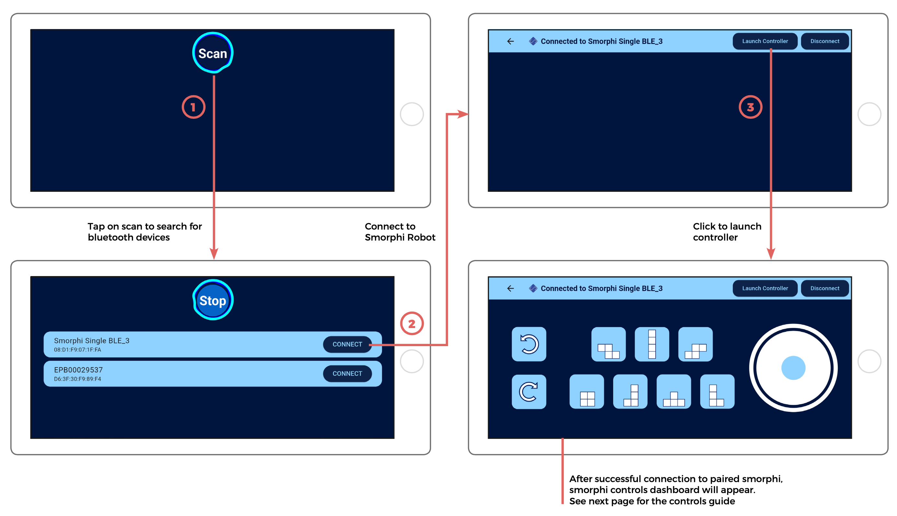
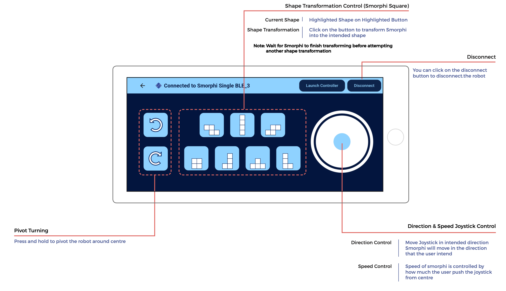

.. _ex1:

Exercise 1
==============
Items needed:
++++++++++++++++
* Smorphi mini / Smorphi\ :sup:`2` kit, which includes the assembly manual and toolbox
* An Android smartphone or tablet
* An M3 hex head screwdriver (optional. An M3 hex Allen key is provided in the toolbox within the Smorphi mini /Smorphi\ :sup:`2` kit)

Objectives of exercise:
++++++++++++++++++++++++
1. Assemble your Smorphi mini / Smorphi\ :sup:`2`
2. Set up your Smorphi mini / Smorphi\ :sup:`2` for teleoperation
3. Learn about the different basic components that make up a robot

Steps / Description:
++++++++++++++++++++++

1. Open up your Smorphi kit and follow the relevant :ref:`assembly manual<assemblymanual>` for smorphi\ :sup:`2` and smorphi single respectively to put together the robot and connect all the electronics
2. Please head over to the `Google Play Store <https://play.google.com/store/apps/details?id=de.kai_morich.smorphi_app>`_ or the `App Store <https://apps.apple.com/sg/app/smorphi/id6482102114>`_  to download the "Smorphi" app
3. Follow the instructions as shown in the picture below, to connect the robot to your phone/ tablet via Bluetooth 
   |A| 
4. The app dashboard is explained in the below image |B| Try out all the basic locomotion (Moving, turning, pivoting and shape change) using the app
5. Have fun!

   
   