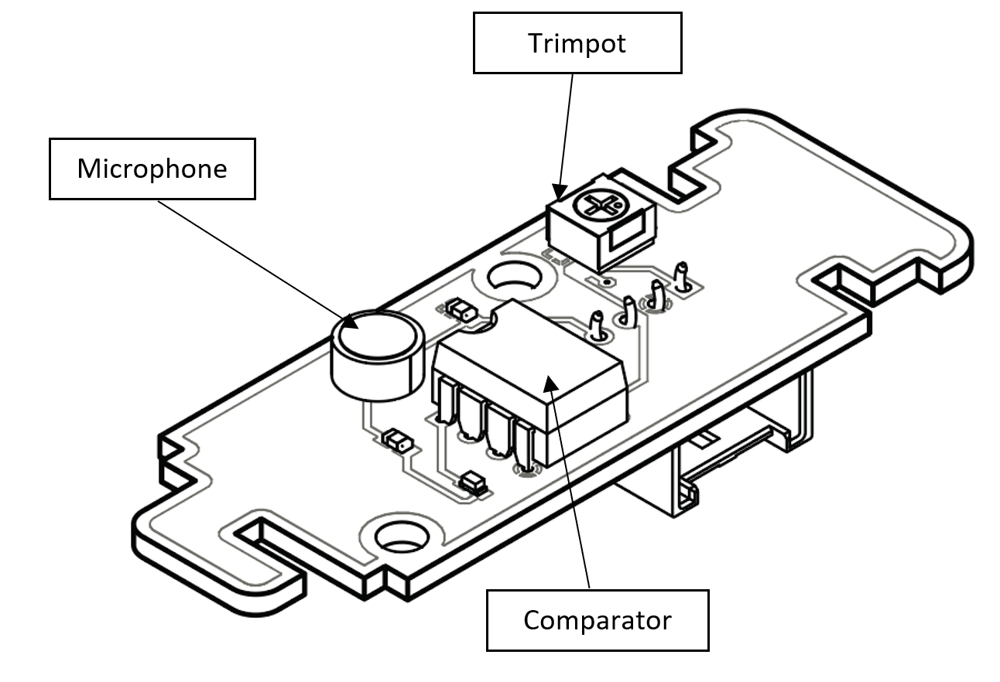

.. _ex10:

Exercise 10
==============
Items needed:
--------------
* An assembled Smorphi mini / Smorphi\ :sup:`2` robot
* Wefaa sound sensor
* A computer
* A USB to USB-C cable
* Internet connection

Objectives of exercise:
-------------------------
1. Learn about the use of sound sensor
2. Explore the different components on the sound sensor board
3. Implement an application of a sound sensor

Steps  / Description:
++++++++++++++++++++++++

#. [What is a sound sensor]
                        |    Sound sensors are typically microphones which are the ears of the robot allowing it to perceive sound. They sense sound from the surroundings and convert it into a voltage which is then sent to the control system for further processing. 
                        |    A great application of sound sensors is voice recognition. This would come in handy in scenarios where you might need to control a robot but your hands are tied up. One great example of this is in the surgery room, where a robot can assist a surgeon with an operation. The surgeon might have both hands full, but could still communicate with the robot using his or her voice.
                        |    Sound sensors can also be used in robotics as a means of vibration detection. The sound sensor provided in your kit acts more like a vibration detector, and is able to react to sounds detected as per your code.

#. [Smorphi's sound sensor]
                        |    |A|

#. [Example code for the sound sensor]
                        |    To aid in your learning, we have already provided you with a sample code below. You can find it under `testing code -> sensors -> Sound_Sensor <https://github.com/WefaaRobotics/Smorphi/blob/main/Smorphi2/Testing_code/sensors/Sound_Sensor/sketch_sep25a/sketch_sep25a.ino>`_ , and access it through the Arduino IDE.
                        |    Try to read through the sample code to understand how it works. If you run the sample sound sensor attached to the Master board, you will be able to use the sound sensor to detect the surrounding sounds. Do remember to use your rotary tool (Trimpot) to adjust the sensitivity of your sound sensor as per need.

#. [Activity] 
                        |    Your task now is to make the robot move forward when it detects sound. You can implement your code in whatever way you like.
                        |    Once you are done, you can compare your solutions `here <https://github.com/WefaaRobotics/Smorphi/blob/main/exercise/exercise_10/exercise_10.ino>`_

#. [Futher Exploration]
                        |    Other than this task, think of different scenarios where a sound sensor will be important and how should your Smorphi react to sound in those scenarios?

