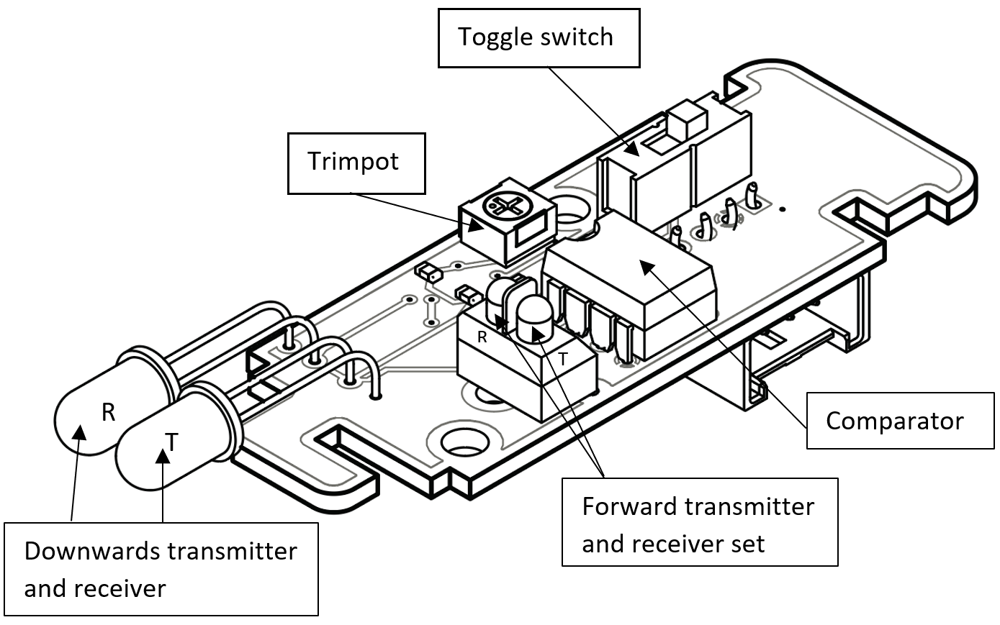
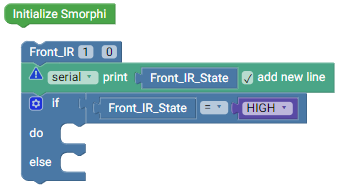

.. _ex11:

Exercise 11
==============
Items needed:
--------------
* An assembled Smorphi mini / Smorphi\ :sup:`2` robot
* Wefaa InfraRed (IR) sensor
* A computer
* A USB to USB-C cable
* Internet connection
* Opaque items that can be used for obstacles

Objectives of exercise:
-------------------------
1. Learn about the use of IR sensor
2. Explore the different components on the IR sensor board
3. Implement an application of an IR sensor

Steps  / Description:
++++++++++++++++++++++++

#. [What are IR sensors]
                        |    Infrared sensors are a type of **Proximity sensors**. 
                        |    Movement is a big area of robotics, whether it be an autonomous robot on mars, or a robotic arm moving to pick goods. These robots need a means to be able to avoid obstacles (for autonomous robots), or to know when an object is within reach to pick up (for robotic arms).
                        |    **Proximity sensors enable robots to detect objects at a distance without the need of physical contact, acting as the eyes of the robot.** 
                        |    They consist of two parts; **transmitter** and **receiver**. 
                        |    The transmitter first transmits a signal, this signal is reflected off an object and returns back to the receiver alerting the robot of an object nearby. Depending on the complexity of the proximity sensor, it can calculate the exact distance of the object.
                        |    Infrared Sensor (IR) uses an infrared beam which is transmitted by the transmitter (it cannot calculate exact distance)

#. [Smorphi's IR sensor]
                        |    |A|

#. [Example code for the IR sensor]
                        |    To aid in your learning, we have already provided you with a sample code for IR sensor below. |B|
                        |    If you run the sample code with the IR sensor attached to the Master board, you will be able to use the IR sensor to detect the surrounding Opaque obstacles. Do remember to use your rotary tool (Trimpot) to adjust the sensitivity of your IR sensor per need.
                        |    Additionally, the switch could be toggled between the forward transmitter and receiver set or the downwards transmitter and receiver set. Depending on your use case, you can toggle the switch accordingly. We will be using the forwards facing transmitter and receiver set for this exercise, so toggle your switch downwards.

#. [Simple obstacle detection activity] 
                        |      Your task now is to make the robot move forwards continuously, and stop only when it detects an obstacle. You can implement your code in whatever way you like. 
                        |      NOTE: Check the input-output you get when switching between the forward transmitter and downward transmitter mode.
                        |      Once you are done, you can compare your solutions `here <https://github.com/WefaaRobotics/Smorphi-Wiki/blob/main/Robot%20exercises%20images/11/2.png>`_

#. [Further Exploration] 
                        |      Other than this task, think of different scenarios where an IR sensor will be important and how should your Smorphi react in those scenarios?

