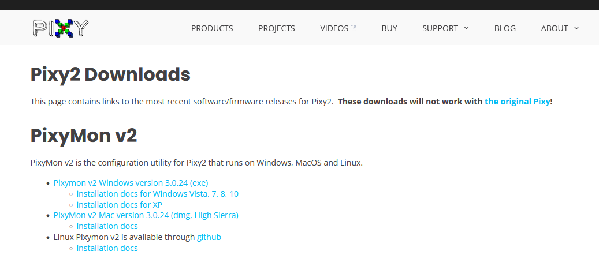
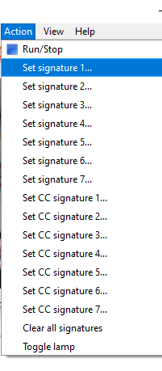
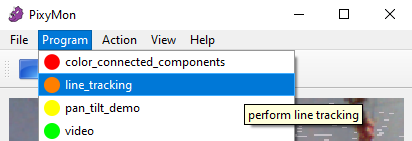

.. _ex15:

Exercise 15
==============
Items needed:
--------------
* An assembled Smorphi mini / Smorphi\ :sup:`2` robot
* Pixycam set (can all be found in the PixyCam box)
* A computer
* Internet connection

Objectives of exercise:
-------------------------
1. Learn what is a pixycam
2. Learn how to set up a pixycam
3. Learn about the possible application of a pixycam
4. Broder perspective of Pixycam application (link to CV, ML, AI)

Steps  / Description:
++++++++++++++++++++++++

#. [Introduce the pixycam]
                        |    Pixy is a fast vision sensor for DIY robotics and similar applications. You can teach Pixy an object just by pressing a button. It’s capable of tracking hundreds of objects simultaneously and only provides the data you are interested in. like colour orientation etc. Pixy comes with a cable to plug in to Arduino, so you can quickly get started, and has a multitude of ways to talk to other devices. https://pixycam.com/pixy-cmucam5/

#. [How to set up the pixycam]
                        |    To quickly understand the functionalities of the pixycam, let’s download the PixyMon software which allow s you to configure your PixyCam. https://pixycam.com/downloads-pixy2/ |A| Download the correct version for your computer’s operation system. Follow the installation software to install PixyMon.

#. [Link the Pixycam to your computer]
                        |    Once the installation procedure of the software is complete, we can now connect the Pixycam to our PC. On the back side of the Pixycam a Mini-USB type connector can be found. Get the suitable cable from the Pixycam box, and then connect the Pixycam to your computer. 
                        |    Once your Pixycam is connected successfully, you should be able to see the video stream from your Pixycam on the PixyMon.

#. [Exercise, inbuilt colour detection] 
                        |    Let’s make Pixy learn the object to detect. The device will recognize the item depending on its colour, thus it is important that the object you choose is of a single colour. Choose any object you like. Place the object to detect before the camera lens, then from the Action menu, select “Set Signature 1…”. |B| Once this has been done, highlight the body of the object on the PixyMon videofeed, by keeping the left mouse button pressed and drag it across the area of colour you want. By releasing the mouse button, the video camera will memorize the item’s colour.
                        |    Now, if you move the Pixycam around in your environment, you should be able to see that, on your PixyMon screen, there will be boxes that are labelled S=1 recognising similar colours to what you have indicated. For example, if you have used a red item to set the colour, the Pixycam will now recognise red coloured objects and surround them with a box labelled S=1.

#. [Further exploration]
                        |    There is a lot more things you can do with the Pixycam and one of it is improving its object detection accuracy. You can find out more about this here: https://docs.pixycam.com/wiki/doku.php?id=wiki:v2:some_tips_on_generating_color_signatures_2 
                        |    There are also some other functions the Pixycam can do which you can see under the Program tab. |C| 
                        |    You can perform a quick google search to find out what the other functions does and try them out!

