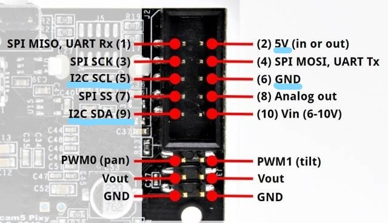
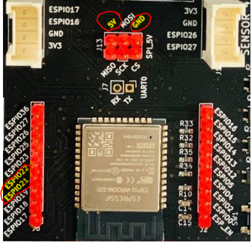
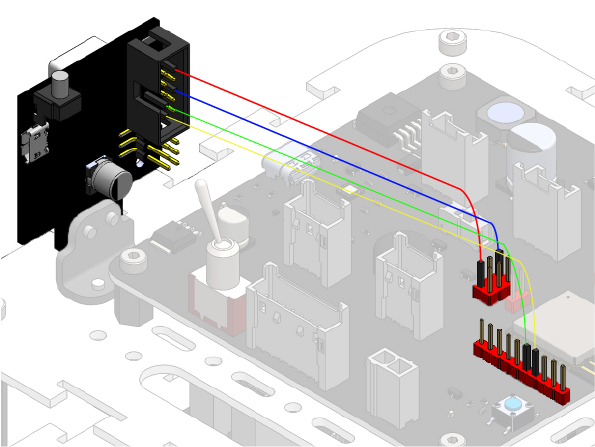
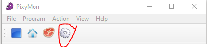
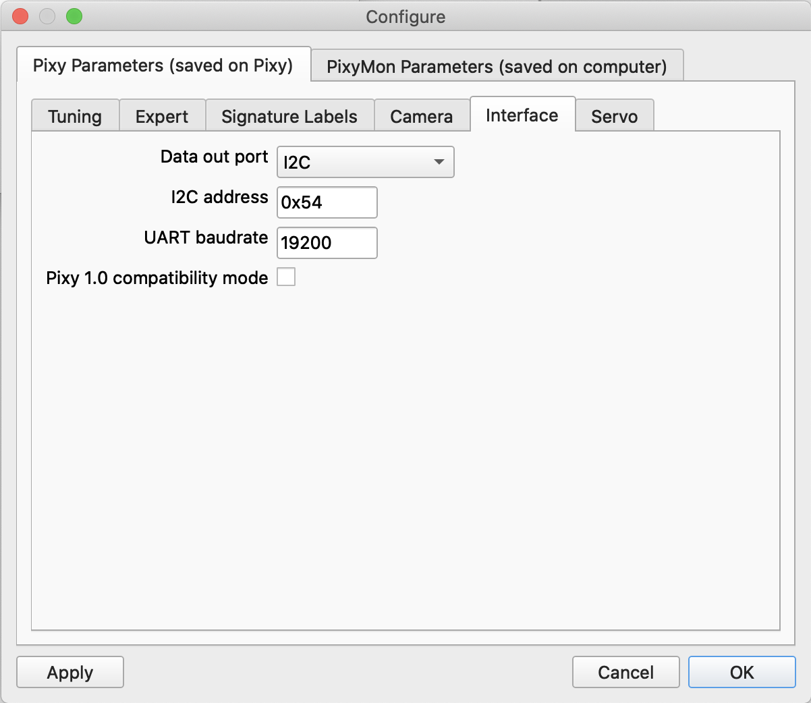
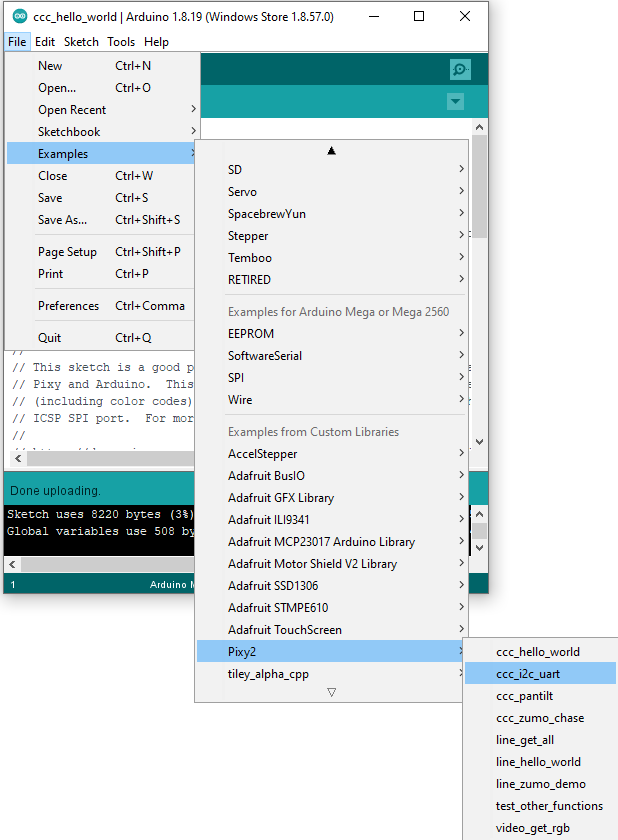
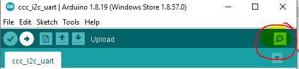
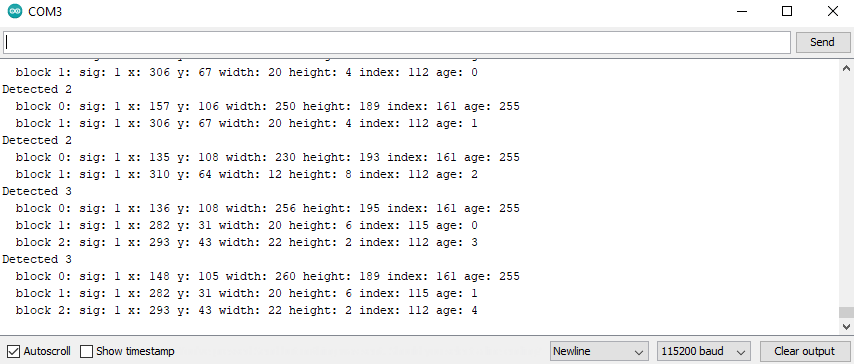
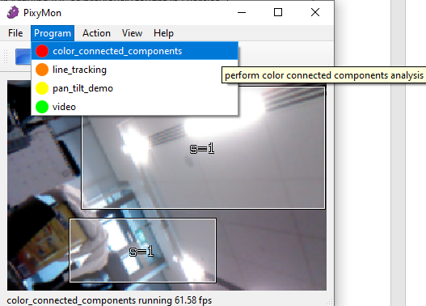

.. _ex17:

Exercise 17
==============
Items needed:
--------------
* An assembled Smorphi mini / Smorphi\ :sup:`2` robot
* A computer
* A USB to USB-C cable
* Internet connection
* 4 jumper female to female cables

Objectives of exercise:
-------------------------
1. Learn about various things you can do with a camera in CV
2. Learn how to connect your pixycam with your Smorphi
3. Learn how to detect colours using the pixycam

Steps  / Description:
++++++++++++++++++++++++

#. [Theory of CV]
                        |    Computer vision is an interdisciplinary field that deals with how computers can be made to gain high-level understanding from digital images or videos, perhaps to recognise specific objects. From the perspective of engineering, it seeks to automate tasks that the human visual system can do. Computer vision is concerned with the automatically extracting, analysing and understanding of useful information from a single image or a sequence of images. And this involves development of various algorithms.
                        |    The Pixycam provided to you has already a few inbuilt and trained Programs that allows you to automatically detect colours, for example, like in the previous exercise.

#. [connecting your Pixycam to your Smorphi]
                        |    For your Pixycam to be able to communicate to your Smorphi, we will have to set it up via the Serial I2C method. There are generally a few different methods of communications you can use to talk to your 
                        |    https://docs.pixycam.com/wiki/doku.php?id=wiki:v2:porting_guide 
                        |    We setup the Pixy to use the I2C mode, we will need 4 female to female jumper wires to connect our Pixycam to the master board. First, plug in one side of each jumper cable to the pins labelled I2C SDA (9), I2C SCL (5), 5V (in or Out) (2), and GND (6) as seen in the image below.
                        |    |A|
                        |    Then, the jumper cable connected to the SDA pin should connect to ESPIO21 on the Master board. The jumper cable connected to the SCL pin should connect to ESPIO22 on the Master board. The jumper cable connected to the GND pin should connect to GND pin on the Master board and the jumper cable connected to the 5V pin should connect to 5V pin on the Master board.
                        |    |B|
                        |    The setup should look like this 
                        |    |C|

#. [Pixycam working]
                        |    Once you have connected your Pixycam to your Smorphi correctly, start up the PixyMon program you downloaded in the previous exercise. Click on the gear icon to go to the configuration window.
                        |    |D|
                        |    In the configuration window, navigate to the Interface page, and setup the interface as below and click apply, and the ok:
                        |    |E|

#. [Execution] 
                        |    Go to your Arduino IDE, File -> Examples -> Pixy2 -> ccc_i2c_uart, to open the ccc_i2c_uart example code
                        |    |F|
                        |    Connect your Smorphi and the Pixycam to your computer via USB seperately, and upload the example code to Smorphi. Remember to press enable on your Smorphi Master board to execute the code once it is fully uploaded onto the Master board.
                        |    Open your serial Monitor by clicking on the magnifying glass button:
                        |    |G|
                        |    You should see something like this on your serial monitor:
                        |    |H|
                        |    These values indicates the objects detected by the Pixycam of the colour that you have set.
                        |    If you get the message “error: no response” from the Arduino serial monitor, first make sure your Pixy2 is running the ccc (color connected components) program from PixyMon, and that you have taught it an object as described in the previous lesson.
                        |    |I|
                        |    This is just one example of what you can do using your Pixycam. You can use this as a template to try out the other programs.
                        |    Try exploring the other programs yourself!

