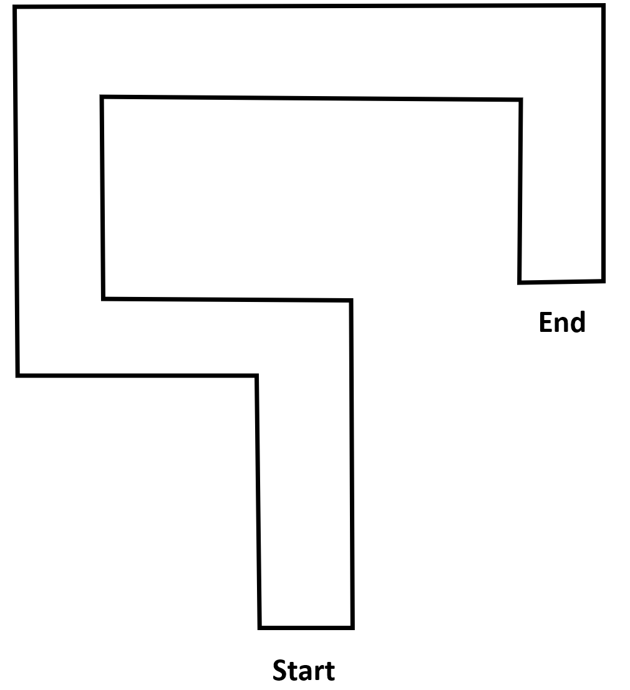
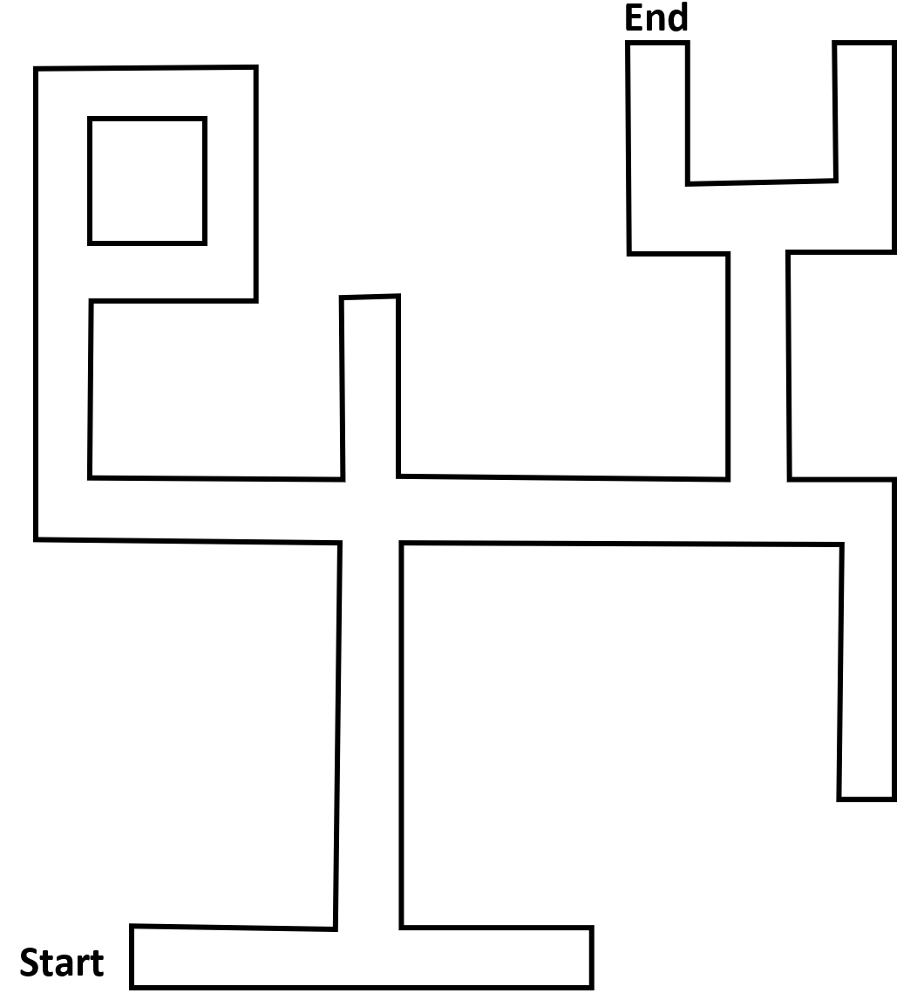

.. _ex18:

Exercise 18
==============
Items needed:
--------------
* An assembled Smorphi mini / Smorphi\ :sup:`2` robot
* Wefaa InfraRed (IR) sensor
* A computer
* A USB to USB-C cable
* Internet connection
* Cardboard sheets or Vanguard paper (you will require this to make the maze)

Objectives of exercise:
-------------------------
1. Experiment with obstacles
2. Train your coding logic

Steps  / Description:
++++++++++++++++++++++++

#. [Template of a maze to build]
                        |    For this exercise, for ease of movement, lets put your Smorphi into its ‘O’ shape configuration.
                        |    Then, install an IR sensor on all 4 sides of the ‘O’ shape configured Smorphi. Make sure the IR sensor has been switched to obstacle detection mode. Then, with some pieces of paper and cardboard, build the maze shown below. Make sure the paper and cardboard are high enough to be detected by the IR sensor, and that the Maze is wide enough for your ‘O’ Shape Smorphi to move through.
                        |    |A|
                        |    By analysing the maze, you can first program your Smorphi to navigate through without using the sensor.
                        |    If you are struggling to figure out the code, you can try this: First code out all the functions.
                        |    Afterwards, try using the conditionals and loops that you have learned to get your Smorphi to complete the maze.
                        |    What is the least number of lines of code you are able to get your program down to? Challenge yourself!

#. [Use your IR sensor to get out of the maze]
                        |    After you have gotten the baseline of the path through the maze, lets now try to get through the maze using the IR sensor. 
                        |    The IR sensor in this case acts as your Smorphi’s eyes and the program you write should receive information from your IR sensor that will trigger a response in your Smorphi, allowing your smorphi to navigate through the maze without knocking down any walls.
                        |    Like in the previous step, after you have gotten a base code that works, try optimising your code by using conditionals and loops and challenge yourself to see how short you can make your code.
                        |    If you are having trouble, here’s the hint: *Smorphi is able to move holonomically in all directions.*

#. [For Blockly users]
                        |    Once you are done, you can compare your solutions `here <https://github.com/WefaaRobotics/Smorphi-Wiki/blob/main/Robot%20exercises%20images/18/2.png>`_ !

#. [For C++/Arduino users] 
                        |    Once you are done, you can compare your solutions `here <https://github.com/WefaaRobotics/Smorphi/blob/main/exercise/exercise_18/exercise_18.ino>`_ !

#. [Extra challenge]
                        |    Just as an opportunity to explore more complex mazes, if you wish to challenge yourself, you can try out the maze below, and get Smorphi to navigate through the maze using your IR sensors. 
                        |    |B| 
                        |    Try and see if your existing code is able to work for this maze. If not, what should you change about the code?Just like the previous 2 steps, you can first try to hard code the path for Smorphi to move from start to finish, before attempting to make Smorphi more intelligent and reactive to its surroundings.
                        |    You can also design your own mazes and try out your code in those mazes.

