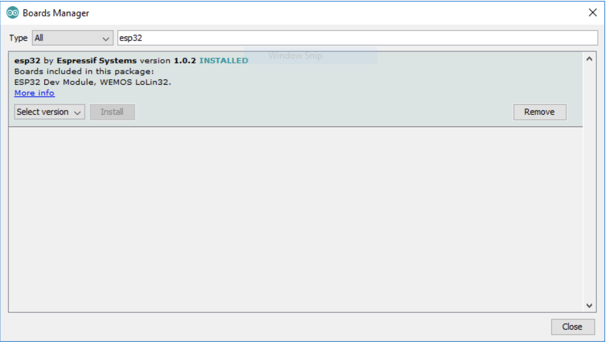

.. _ex2:

Exercise 2
==============
Items needed:
--------------
* An assembled Smorphi mini / Smorphi\ :sup:`2` robot
* A computer
* A USB to USB-C cable
* Internet connection

Objectives of exercise:
-------------------------
1. Download and set up Arduino IDE
2. Learn how to include and install library
3. Setting up of Smorphi for coding to customise functionality
4. Learn some simple debugging skills
5. Learn how to look up information on Google
6. Learn how to use the Arduino IDE

Steps  / Description:
++++++++++++++++++++++++

#. [Download the Arduino IDE]
                        |  Go to https://www.arduino.cc/en/Guide to download Arduino IDE. The Arduino IDE makes it easy to write code and upload into the Arduino based board we are using for Smorphi. Choose the correct version of Arduino IDE according to the type of computer you are using. Eg. If you are using Windows, download the version meant for Windows. |A| Integrated development environment (IDE) is software for building applications that combines common developer tools into a single graphical user interface (GUI). An IDE typically consists of:
                        |    * Source code editor: A text editor that can assist in writing software code with features such as syntax highlighting with visual cues, providing language specific auto-completion, and checking for bugs as code is being written.
                        |    * Local build automation: Utilities that automate simple, repeatable tasks as part of creating a local build of the software for use by the developer, like compiling computer source code into binary code, packaging binary code, and running automated tests.
                        |    * Debugger: A program for testing other programs that can graphically display the location of a bug in the original code. 
#. [Setup the Arduino IDE]
                        |    In your Arduino IDE, go to \ **File > Preferences**\ |B| 
                        |    Enter the following into the “Additional Board Manager URLs” field:  
                        |    ``https://raw.githubusercontent.com/espressif/arduino-esp32/gh-pages/package_esp32_index.json`` 
                        |    Then, click the “OK” button: |C| 
                        |    Open the Boards Manager. Go to \ **Tools > Board > Boards Manager…**\ |D| 
                        |    Search for **ESP32** and press install button for the **“ESP32 by Espressif Systems“**: |E| 
                        |    That’s it. It should be installed after a few seconds. |F| 
#. [Download the Smorphi libraries]
                        |    Proceed to download the appropriate version of our user code library as shown in the table below via the download zip button. It can be found in the drop down after clicking on the green Code button.
                        .. list-table:: SOFTWARE LIBRARY VERSIONS
                            :widths: 25 25 30
                            :header-rows: 1

                            * - VERSION 
                              - ACTIVE PERIOD
                              - LIBRARY LINK
                            * - Version 1.0
                              - June 2022 - March 2024
                              - `Ver_1.0 <https://github.com/WefaaRobotics/Smorphi/tree/v1.0>`_
                            * - Version 2.0
                              - March 2024 - Present
                              - `Ver_2.0 <https://github.com/WefaaRobotics/Smorphi/tree/V2.0_HT>`_
                        |     |G|
#. [How to include Smorphi library into Arduino IDE] 
                        |      Navigate to the directory that you have downloaded the Smorphi library to --> Unzip / Extract the "smorphi" zip file --> Copy all the internal folders --> Paste all the folders in libraries folder (or) you may also create a folder with the name "libraries" inside your respective arduino directory as shown in the picture below: |H| |I|
#. [What are code libraries?]
                        |      If you go into the folder you downloaded from Wefaa Github, you will see the files below. Those of type \‘C++ Source File\’ and C Header Source File are the libraries you will be accessing when you code for the next few exercises.|J|
#. [Add the supporting library] 
                        |      Try clicking the Verify button, you will need to save your file first. |K| You will see this error message: |L| This is because another library that the Smorphi library needs, the Adafruit_Motor_Shield_V2_Library, has not been included. So let’s include that library. 
                        |      Go to the \‘Include Library\’ menu and select \‘Manage Libraries…\’ |M| 
                        |      In the search bar, look up the \‘Adafruit_Motor_Shield_V2_Library\’ and install the latest version. |N|
                        |      You will get a pop up that says there are other dependencies that are missing. Click on the \‘Install all\’ button. |O| 
                        |      Close the library Manager. You can now try to Verify again. You will see another error. |P|
                        |      Like before, go to the \‘Manage Libraries…\’ Menu to download the library Adafruit_MCP23017_Arduino_Library. 
                        |      Verify the code now. There should be no errors thrown. |Q|
#. [Test your setup] 
                        |      Connect your computer to the board and select the port.
                        |      **NOTE:** If the port is not detected by your windows computer, look up on google for **"Silicon Labs CP210x driver"** and download the **"Universal Windows Driver"** under the downloads tab as shown in the image below:|R|
                        |      Once downloaded, you may extract the zip folder and select the **"silabser.inf"** and right-click to install the driver as shown in the image below:|S|
                        |      Once installed, connect your robot to the computer and select the right port number in the Arduino IDE by referring to the **"Device Manager"** and look up for the CP210x driver as shown in the image below. |T|
                        |      Once done, Key in the below code into your Arduino IDE.
.. code-block::
                                                                                      
   #include <smorphi.h>
   Smorphi my_robot;
   void setup(){
    Serial.begin(115200);
    my_robot.BeginSmorphi();
   }
   void loop (){
    my_robot.MoveForward(50);
    delay(3000);
    my_robot.MoveForward(0);
    delay(3000);
   }
   //Your Smorphi should move forward for 3 seconds, stop for 3 seconds and then repeat. 

#. **NOTE:** 
        |    Usually, when you upload the code to the master board, the process should complete automatically. However, sometimes the upload will be stuck at \‘connecting……\’ |U| 
        |    There are 2 solutions for this: 
        * Before it resolves into an error, press and hold the Boot button and click the enable button on the Master board at the same time, then release and wait. The code should complete the upload to the master board. 
        * You can unplug and reconnect the USB cable from the Master board to your computer and then reupload the code.

.. |G| image:: 2.2.png
               :width: 800 

.. |K| image:: 2.5.png
               :width: 800 

   

.. |T| image:: 2.15.jpg
               :width: 800

.. |U| image:: 2.13.png
               :width: 800

