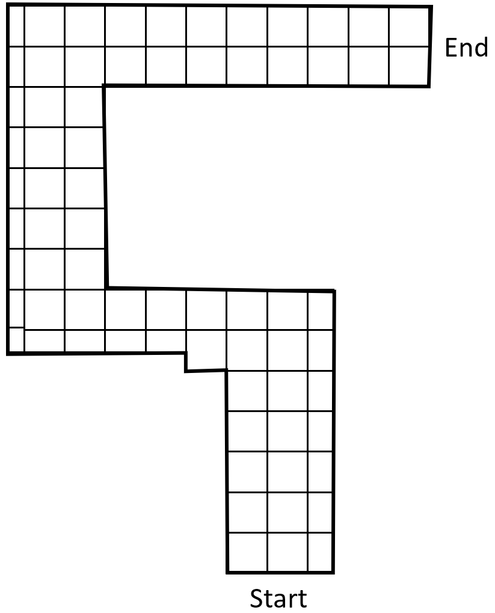

.. _ex21:

Exercise 21
==============
Items needed: 
--------------
* An assembled / Smorphi\ :sup:`2` robot
* Wefaa InfraRed (IR) sensor 
* Husky camera 
* A computer
* A USB to USB-C cable 
* Internet connection
* Cardboard sheets or Vanguard paper (you can reuse these from previous experiment)

Objectives of exercise:
---------------------------
1. Experiment with maze with added element of shape change 

Steps / Description: 
++++++++++++++++++++++
#. [Template of a maze to build]
                        |    For this exercise install back the other 3 modules of your robot. 
                        |    First make sure you have installed an IR sensor at the front of Smorphi. Make sure the IR sensor has been switched to obstacle detection mode. Then, with some pieces of paper and cardboard, build the maze shown below. Make sure the paper and cardboard are high enough to be detected by the IR sensor. For the width of the maze, follow the maze template arrangement below. 
                        |    |A|   
                        |    The box indicates the width of the path. One box = one width of 1 Smorphi module 
                        |    By analysing the maze, you can first program your Smorphi to navigate through the maze. You should try as much as possible to use shape-changing to help navigate through.
                        |    If you are struggling to figure out the code, you can try this: First code out all the functions. Think of a way you can integrate the huskycam to help you in solving the maze. Afterward, try using the conditionals and loops that you have learned to get your Smorphi to complete the maze.
                        |    What is the least number of lines of code you are able to get your program down to? Challenge yourself!
#. [Solutions ]
                        |    Once you are done, you can compare your solutions `here <https://github.com/WefaaRobotics/Smorphi/tree/V2.0_HT/exercise/exercise_21/Husky_Shape_Changer_Maze_Solver>`_
                        |    Note: The code is split into 3 files with the Husky_Shape_Changer_Maze_Solver.ino being the main file.
#. [Unleash your creativity]
                        |    Design your own maze to try out more variations of shape changing to navigate through mazes
#. [Extra credit ]
                        |    If you have to use sensors and shape-changing to get out of the maze, what would your plan be? Propose some sensors and write down some pseudo code to justify your idea.

