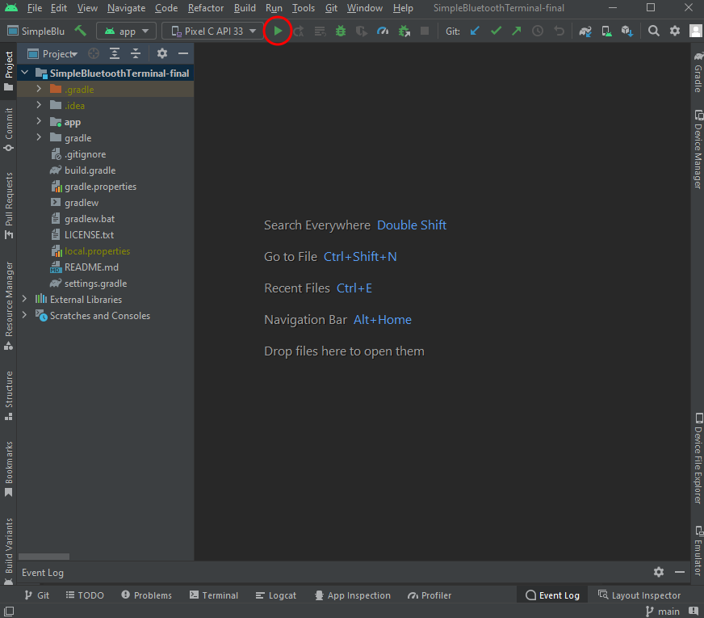
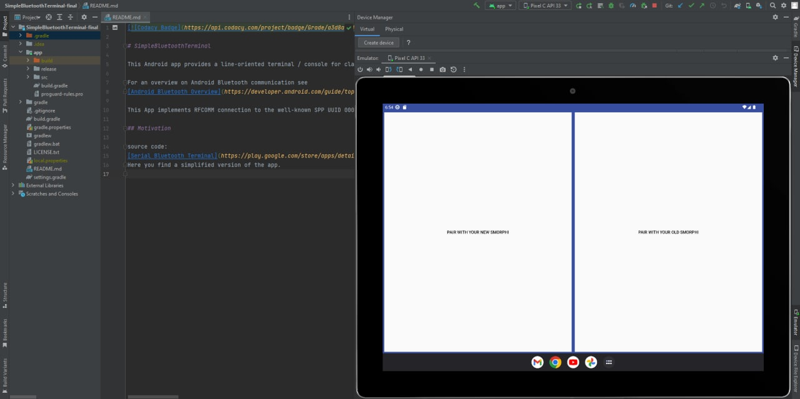

.. _ex22:

Exercise 22
=============
Items needed:
---------------
* An assembled / Smorphi\ :sup:`2` robot 
* A computer 
* Internet connection 

Objectives of exercise:
-------------------------
1. Learn how to code in Java 
2. Learn how to use Android studios 
3. Self-exploration skills 
4. Make your own app to control the robot 
   
We reccommend this exercise for slightly more advanced learners and learners who wish to have a challenge. There will be a lot of self-exploration, but we will eventually develop a version that is more guided

Steps / Descriptions:
+++++++++++++++++++++++
#. Now that you have been exposed to coding, we can try to make our own app for the Smorphi robot. Coding in Java would be the same logic as coding in Arduino. You can look through the Java portion code of our current app here: https://github.com/WefaaRobotics/Smorphi-App-Android/tree/main/SimpleBluetoothTerminal-final/app/src/main/java/de/kai_morich/smorphi_app The Java code is for the functions of the app, while the xml files controls how your app looks: https://github.com/WefaaRobotics/Smorphi-App-Android/tree/main/SimpleBluetoothTerminal-final/app/src/main/res/layout

#. In order to run the app on the Android Studio emulator, we have to download the files and Android Studio. The application files can be downloaded here: https://github.com/WefaaRobotics/Smorphi-App-Android.Android studio can be downloaded via this link: https://developer.android.com/studio.
#. After istalling Android Studio, we need to set up the environment. You can refer to this video from 3.12 to 18.52 for the set up of environment on Android Studio: https://youtu.be/fis26HvvDII?t=192 (For better experience, we advise you to use tablet devices as your emulator)
#. Now we can open the project on Android Studio to run it on the emulator. Open the file named "SimpleBluetooth Terminal-final" from where you downloaded the file. Once file is opened, click on the "run" button to run the app on the emulator |A|
#. We can simulate the app using our emulator on Android Studio |B| 
#. Make and customise your own app from our code, or from writing your own code from scratch. You can change the Java files to change the functions in the app, or the xml files to change the appearance of the app. 

