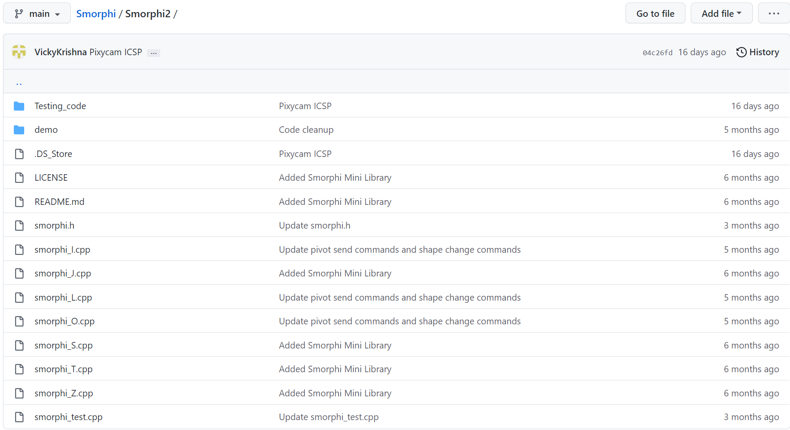
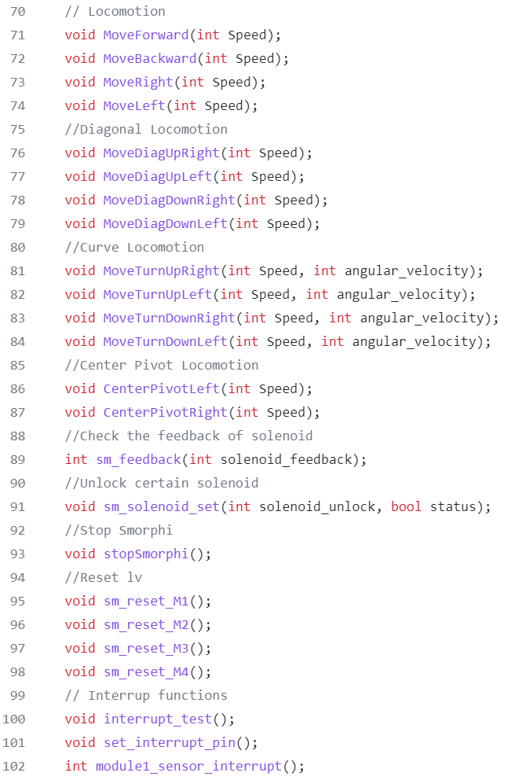
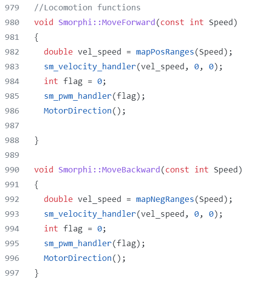

.. _ex23:
Exercise 23
=============
Items needed:
----------------
* An assembled / Smorphi\ :sup:`2` robot
* A computer
* A USB to USB-C cable 
* Internet connection

Objectives of exercise:
-------------------------
1. In depth going through of the Smorphi library 
2. Self-study exploration
3. Build your own version of the Smorphi library 

Steps / Description:
++++++++++++++++++++++++
1. This process is actually a rather long, multidisciplinary and multi-step process. We might break them down into easier digestable steps in the future. But for now, for advance learners and learners that wish to have a challenge, you can look through all the header files in our Smorphi library and then see how you can optimise and write your own version of the library.

|

2. For / Smorphi\ :sup:`2` users, you can refer to the / Smorphi\ :sup:`2` library using this link: https://github.com/WefaaRobotics/Smorphi

|

3. For Smorphi mini users, you can refer to the Smorphi mini library using this link: https://github.com/WefaaRobotics/Smorphi/blob/main/Smorphi_mini/

|

4. In the library, you can see the C header Source Source File (.h) and C++ Source Files (.cpp). 
   
|A|

|

5. As you scroll throught the smorphi.h / smorphi_mini.h header file, you can see the various functions that can be called in your code for the Smorphi. 

|B| 

Header files are meant to show the functions available in the library. Therefore, these functions are not defined in the file. 

|

6. In order to know what is going on behind every function, we have to take a look at the .cpp files, specifically the smorphi_test.cpp file. You can see the code for the functions that are shown in the header file. 

|C|

To To have a better understanding of what each function does, you can take a look at :ref:`Smorphi Code Documentation <code_refs>` 

|

7. Based on what you want Smorphi to do, you can create and add in your own functions to the .cpp files and .h files respectively.

|

8. For advanced learners, you can try to optimise with regards to size of library, speed of the library, etc.

