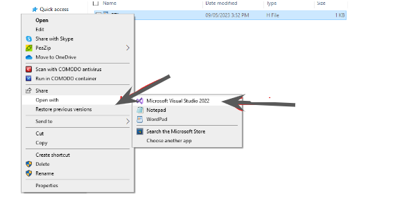
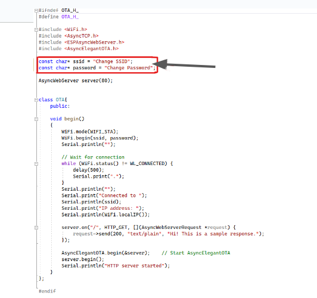
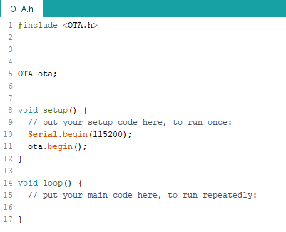
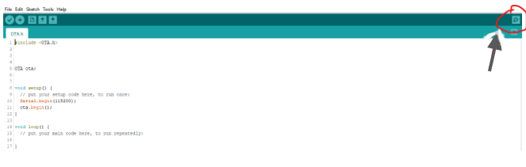
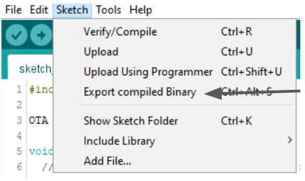
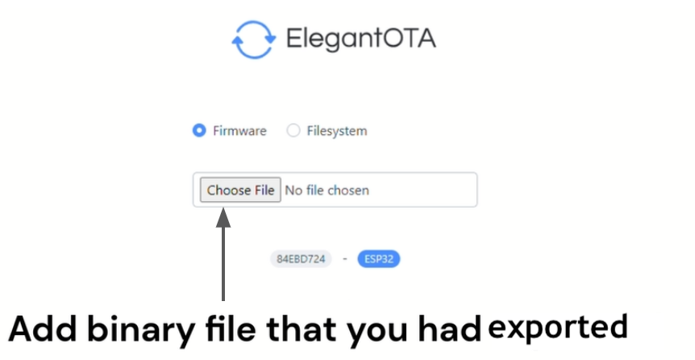

.. _ex24:

Exercise 24
==============
Items needed:
--------------
* An assembled / Smorphi\ :sup:`2` robot
* A computer or laptop
* A USB to USB-C cable 
* Stable internet connection 

Objective of exercise:
-------------------------
1. To upload the compiled source code onto smorphi via wireless modes using WiFi through OTA(Over the Air) method

Steps / Description:
+++++++++++++++++++++++
1. We recommend downloading visual studio code to edit the C++ and .h files : https://code.visualstudio.com/download .

|A|

2. (For Windows)Go to This PC > Local Disk > Program Files(x86) > Arduino > libraries > OTA
   
   |

   (For MacOS) Go to Finder > Documents > Arduino > libraries > OTA

   |

   There, you would find the file called OTA.h

3. Right-click on the OTA.h file and then select “open with Visual Studio Code” 
   |B|

4. Modify the OTA.h file by adding your own WiFi SSID and WiFi Password. Thereafter, Save it.
   |C|

5. In your Arduino IDE, open a new file and add in the following lines of code

                                    |  #include<OTA.h>
                                    
                                    |  OTA ota;

                                    |  void setup(){

                                    |  Serial.begin(115200);

                                    |  ota.begin();

                                    |  }

                                    |  void loop(){

                                    |  }

                                    |  After including the above code snippets in a new Arduino file, it should look like this 
                                    |D|

6. Upload the code to your Masterboard and when it is done, open your serial monitor and the IP address should be there. 
   
   |

   |E|

   |
   Copy the IP address from the serial monitor and paste the IP address on your web browser. Add in “/update” after the IP address.(NO spaces needed). 
   
   |F|

7. Note that, In order for any code to be uploaded via the OTA method, the following 3 lines of code must be included in your source code.

                                    |  #include<OTA.h>

                                    |  OTA ota;

                                    |  ota.begin();

8. After the code is completed, save the file and select “Sketch → Export compiled Binary" on the menu bar of the Arduino IDE 
   |G| 
                                    |  After it has completed exporting, there will be a new file in the user specified location

9.  Now you can upload the exported “.bin” file on the OTA website on your web browser and it will be uploaded over the WiFi network without any USB to USB-C cable connection. 
   |H|

.. |A| image:: 24.1.jpg 
                 :width: 800

