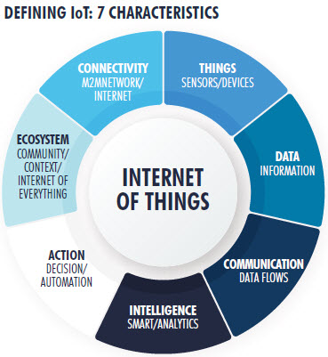
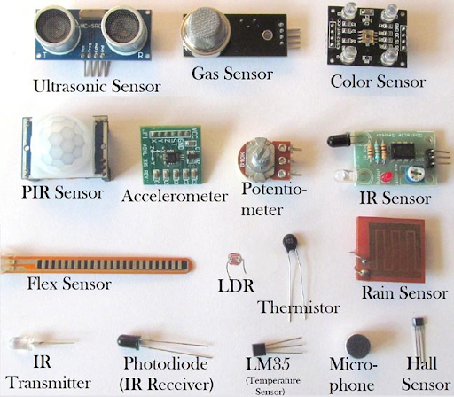
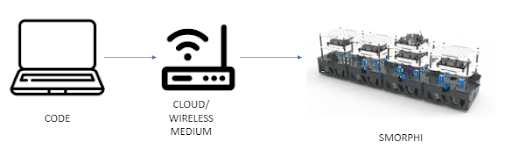
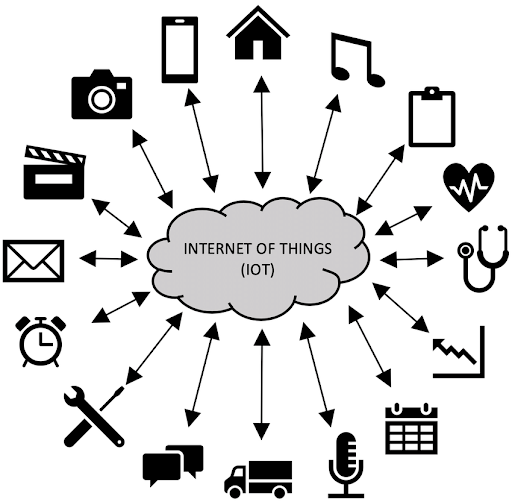
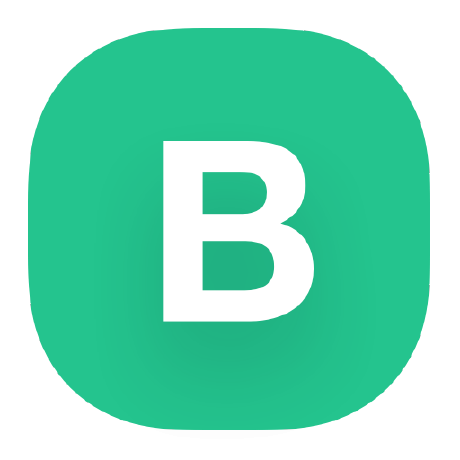
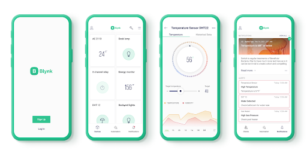
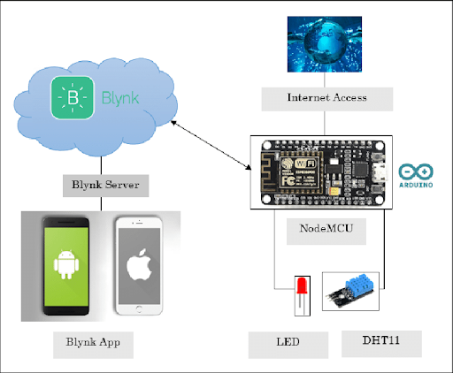

.. _ex25:

Exercise 25
============
Items needed:
------------------
* A computer
* An iOS/ Android phone (for using Blynk IoT app)
* Internet connection 

Objective of exercise:
------------------------
1. Learning about IoT/Blynk platform 

Steps / Description:
+++++++++++++++++++++++++
#. IoT stands for the "Internet of Things." It is a network of physical objects or "things" embedded with sensors, software, and other technologies that enable them to connect and exchange data over the internet. These objects refer to everyday devices or specialized industrial machines. The main idea behind IoT is to interconnect these devices to collect and share data, which can then be analyzed and utilized for various purposes.
   
   |

   The IoT ecosystem is continuously expanding, with more devices and applications being developed to improve various aspects of our lives and industries. However, as the number of connected devices grows, ensured security, privacy, and interoperability remains a significant challenge for the IoT industry.

#. Main components of Iot |A| 
                                        |  i. Things/Devices: Examples include smartphones, smartwatches, smart home devices (like thermostats, smart speakers, and security cameras), industrial machines, vehicles, and more.
                                        
                                        |  ii. Sensors: such as temperature, humidity, light, motion, or any other relevant information. |B|
                                        
                                        |  iii. Connectivity/Internet Connectivity: Common connectivity options include Wi-Fi, Bluetooth, Zigbee, cellular networks, etc. |C|
                                        
                                        |  iv. Data Processing and Analytics: The data collected from IoT devices is sent to cloud servers or edge computing systems for processing and analysis.
                                        
                                        |  v. User Interface: Users interact with IoT systems through user interfaces like mobile apps, web portals, or voice-activated assistants.

                                        |  vi. Security and Privacy: As IoT involves the exchange of sensitive data and control over physical devices, security is a critical aspect.

#.	[Some Examples of IoT Applications] |D|
                                        |  i. Smart Homes: heating, security systems, and appliances.

                                        |  ii. Healthcare: remote patient monitoring, wearable health devices, and tracking medical equipment and supplies.

                                        |  iii. Industrial IoT (IIoT): to monitor and optimise processes, predict equipment failures, and enhance overall efficiency.

                                        |  iv. Agriculture: precision farming, monitoring soil conditions, and tracking livestock.

                                        |  v. Transportation: traffic management, vehicle tracking, and autonomous vehicles. 

                                        |  vi. Smart Cities: efficient urban infrastructure, waste management, and public services.

#. Blynk is an IoT platform for iOS or Android smartphones that controls Arduino, Raspberry Pi and NodeMCU via the Internet. This application enables users to easily build and control IoT applications using their smartphones. This platform simplifies the process of creating IoT projects by providing a user-friendly mobile app and cloud-based infrastructure to connect and communicate with hardware devices. Blynk was created to bridge the gap between the physical world of hardware and the digital world of mobile apps. |E|

#. [Features of Blynk] 
                                        | |F|
                                        |
                                        | Mobile App: Blynk offers a mobile app that is available for both Android and iOS devices. The app acts as a control interface, allowing users to interact with their IoT projects, monitor sensor data, and control connected devices from anywhere with internet access.
                                        | Cloud Connectivity: Blynk uses a cloud-based infrastructure to handle communication between the mobile app and the hardware devices. This cloud connectivity ensures that users can remotely control and monitor their IoT projects from anywhere in the world. 
                                        |
                                        | |G|
                                        |
                                        | Virtual Pins: Blynk uses virtual pins to facilitate communication between the mobile app and hardware. Virtual pins allow users to send and receive data without the need for directly wiring hardware components to specific pins.

