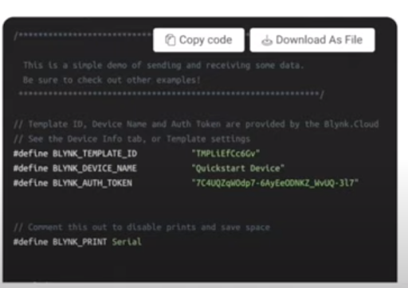

.. _ex26:

Exercise 26
=============
Items needed:
-----------------
* Computer
* A USB to USB-C cable
* Internet connection 
* Wefaa Smorphi Masterboard 

Objectives of exercise:
-------------------------
1. Learn about how to use Blynk and Smorphi Masterboard together
2. Learn how to get data Blynk wirelessly 
3. Learn how to control with Blynk wirelessly 

Steps / Description:
++++++++++++++++++++++
#. First download the Blynk app `from here <https://blynk.io/>`_

   After downloading, do create an account for Blynk

#. After creating an account, you will see some icons in the bottom left corner. To connect the master board to Blynk, press on the circle icon and then click on ‘Quickstart’ |A|

#. First, choose the hardware you would be using(in this case, esp32). Secondly, After establishing wifi connectivity, click on Arduino.
   Follow this video to understand initial setup better. `Blynk video tutorial <https://www.youtube.com/watch?v=Vo_lRov2MrI&list=PLFepjo7TI_AFu8UiU9y_FZM4JK8uA4Z54&index=3>`_

#. Now, go to Arduino. Press on Tools and click on Manage Libraries.|B| Search for Blynk and install the latest verison. |C|

#. Now, you can go back to Blynk and enter your Wifi Credentials into Blynk.
   After that, you can copy the base code and paste it into the Arduino. Then, upload the code. Once it is uploaded, the device will be connected and you can see the uptime in Blynk.|D|

#. [Learning to create Datastreams]
                                    |  Go to Blynk, and click on Templates. Thereafter, select your Quickstart Template.
                                    |  |E| 
                                    |  Then, select ‘Datastreams’ and click on edit. 
                                    |  |F| 
                                    |  Now select ‘New datastream’.
                                    |  |G|
                                    |  (For button/switch datastream)
                                    |  Change Data Type to Integer. For the pin number, you can assign any number you want, but for this exercise we use V2 or V3. 
                                    |  |H|
                                    |  (For Gauge datastream)
                                    |  Change the Datastream as per instructions in the picture below.
                                    |  |I|
                                    |  Follow this video to understand the above steps better. `Blynk datastream setup tutorial <https://www.youtube.com/watch?v=IQyistaqj1U&list=PLFepjo7TI_AFu8UiU9y_FZM4JK8uA4Z54>`_
#. [Editing Dashboard] 
                                    |  |J|
                                    |  Go to WebDashboard and drag and drop the gauge and button/switch widgets.

                                    |  Click on settings, then choose the ‘Datastream’ that was created in the above steps.
                                    |  |K|
#. [Activity]
                                    |  For this exercise, you need to make use of the temperature sensor and the master board led. Your task now is to make Blynk show the temperature and once it is above a certain threshold temperature, the led can be toggled on.
                                    |  Other than this, think of other scenarios where a temperature sensor will be important and how the master board could react to different temperatures.
                                    |  For this exercise, the following pins are used on the masterboard.

                                    |  Led pin = 2
                                    |  Button pin = 10
 
                                    |  Make sure the arduino "Tools" settings are as as follows: 
                                    |       * Make sure the flash frequency is in 40MHz
                                    |       * CPU Frequency is in 240MHz
                                    |       * The flash mode in “QOUT”
                                    |       *  Flash Size is in 4MB
                                    |       * Partition Scheme is in Default 4MB with spiffs (1.2MB APP/1.5MB SPIFFS) |L|
                                    |  Once you are done, you can compare your solutions `here <https://github.com/WefaaRobotics/Smorphi/blob/main/exercise/exercise_25/blynk_setup/blynk_setup.ino>`_

.. |F| image:: 26.6.png 
             :width: 800
.. |G| image:: 26.7.png 
             :width: 800

.. |L| image:: 26.12.png 
             :width: 800 