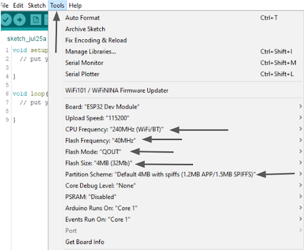

.. _ex27:

Exercise 27 
===============
Items needed:
------------------
* Computer
* A USB to USB-C cable
* Internet connection
* An assembled Smorphi mini // Smorphi\ :sup:`2` robot
* Blynk account

Objective of exercise:
------------------------
1. Learn about Blynk
2. Learn how to control Smorphi using Blynk

Steps / Description:
+++++++++++++++++++++++
#. [Template of a maze to build]
                            |  For this exercise, for ease of movement, let's put your Smorphi into its ‘O’ shape configuration.

#. [Some important settings to change in Arduino]
                            |  Make sure the arduino "Tools" settings are as as follows:
                            |       * Make sure the flash frequency is in 40MHz
                            |       * CPU Frequency is in 240MHz
                            |       * The flash mode in “QOUT”
                            |       * Flash Size is in 4MB
                            |       * Partition Scheme is in Default 4MB with spiffs (1.2MB APP/1.5MB SPIFFS) 
                            |
                            |  |A|

#. [Activity]
                            |  For this exercise, make the Smorphi move with a click of a button using Blynk. And, with another click it would stop.
                            |  Challenge yourself by getting the Smorphi to move from one end to another.

#. [For C++/Arduino users]
                            |  Once you are done, you can compare your solutions `here <https://github.com/WefaaRobotics/Smorphi/blob/main/exercise/exercise_26/blynk_button_for_one_direction/sketch_aug17c.ino.>`_

#. [Extra challenge]
                            |  Just as an opportunity to explore more complex mazes, if you wish to challenge yourself, you can try out the maze below, and get Smorphi to navigate through the maze using Blynk. 
                            |
                            |  |B|
                            |
                            |  Challenge your own coding skills. Try to make a code that can make Smorphi2 move left, right and backwards with the Blynk Button.
                            |  Once you are done, you can compare your solutions at `here <https://github.com/WefaaRobotics/Smorphi/blob/main/exercise/exercise_26/Blynk_button_for_all_directions_/Blynk_button_for_all_directions_.ino>`_
                            |
                            |  You can also design your own maze and try out your code.

