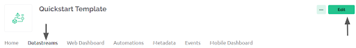

.. _ex28:

Exercise 28
==============
Items needed:
----------------
* A computer 
* A USB to USB-C cable
* Internet connection
* An assembled Smorphi mini // Smorphi\ :sup:`2` robot
* Blynk account

Objective of exercise:
---------------------------
1. Learn about Blynk
2. Learn how to control Smorphi using Blynk

Steps / Description: 
++++++++++++++++++++++++
#. Firstly, go to your Blynk website and click “Quickstart Template”.
   |A|

#. Next, go to “Datastreams” and click on the “edit” button.
   |B|

   |

   Then, click on “New Datastream” and choose Virtual Pin. 
   
   |

   |C|

   |

   Change the virtual pin number and Data Type to string. 
   
   |
   
   |D|

#. Go on your phone, download the Blynk IoT app and log in.

#. After logging in, press on your quickstart device and press the wrench. 
   
   |

   |E|
   
   |
   
   Drag and drop the joystick and click on it in order to go to advanced mode and click the datastream “joystick advance v3”(The virtual pin name created earlier). 
   
   |
   
   |F| 
   
   |G|

#. [Some important things to change in Arduino]
                    |  Make sure the arduino "Tools" settings are as as follows:
                    |    * Make sure the flash frequency is in 40MHz
                    |    * CPU Frequency is in 240MHz
                    |    * The flash mode in “QOUT”
                    |    * Flash Size is in 4MB
                    |    * Partition Scheme is in Default 4MB with spiffs (1.2MB APP/1.5MB SPIFFS) 
                    |    |H|

#. [Coordinates code]
                    |  You can try out first and once you are done, you can compare your solutions at `here <https://github.com/WefaaRobotics/Smorphi/blob/main/exercise/exercise_27/6.0__Coordinates_code_/6.0__Coordinates_code_.ino>`_

#. Open Arduino Serial Monitor. We can now see all the coordinates being printed on the serial monitor for the Blynk joystick. By obtaining the joystick range value, you can understand the digital values of the joystick that are transmitted when you use the joystick to rotate between 0 to 360 degrees (in 2D space). For this exercise, the joystick range has already been set.

#. [Challenge]
                    |  Programme a code to control Smorphi using the Blynk joystick and reach the end. Test your knowledge of coding!! 
                    |  |I|
                    |  If you struggle to figure out the code, Hint: First code out all the functions/ logic(Pseudocode), then try to compare your solution at `here <https://github.com/WefaaRobotics/Smorphi/blob/main/exercise/exercise_27/9.0__Joystick_code_/9.0__Joystick_code_.ino>`_

#. [Second Challenge]
                    |  With the Joystick code, add more functions and make / Smorphi\ :sup:`2` change shapes.
                    |  You can try out first and once you are done, you can compare your solutions at `here <https://github.com/WefaaRobotics/Smorphi/blob/main/exercise/exercise_27/11.0_Answer_code_/11.0_Answer_code_.ino>`_

#. You, can also add additional functionality of turning the robot clockwise and anticlockwise using the buttons on Blynk interface. 

.. |H| image:: 28.8.png 
                 :width: 800
.. |I| image:: 28.9.png 
                 :width: 800
