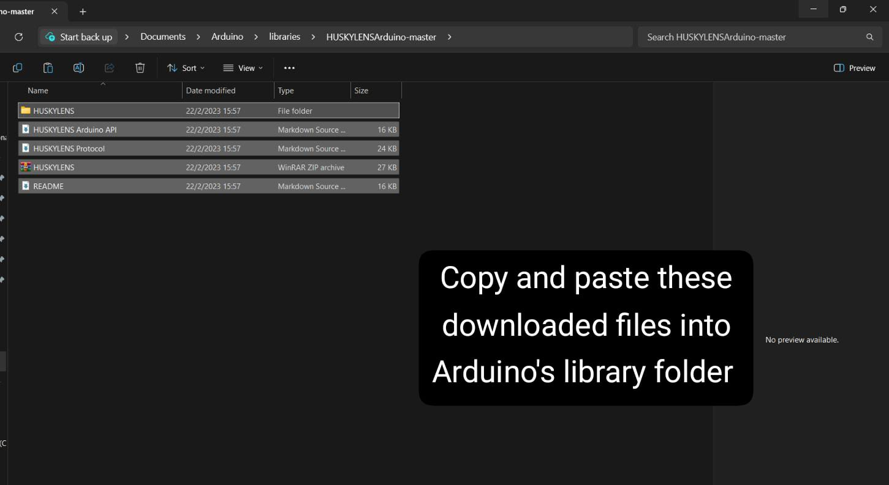

.. _ex29:

Exercise 29 
==============
Items needed:
----------------
* Smorphi\ :sup:`2` robot
* HuskyLens set (can all be found in the HuskyLens box)
* A computer 
* Internet connection 

Objective of exercise:
-----------------------------
1. Learn what is a HuskyLens
2. Learn how to set up a HuskyLens
3. Learn about the possible application of a HuskyLens
4. Broder perspective of HuskyLens application (link to CV, ML, AI)
 
 Steps / Description: 
+++++++++++++++++++++++++
#. [Introducing the HuskyLens camera]
                                    |  HuskyLens offers seamless integration with Smorphi2 through UART or I2C protocols, empowering users with a versatile AI machine vision sensor featuring 7 distinct functionalities: face recognition, object tracking, object recognition, line tracking, color recognition, tag recognition, and object classification. With its intuitive interface, HuskyLens simplifies the process of implementing complex algorithms, making it ideal for enthusiasts seeking to embark on innovative and creative projects. More details on HuskyLens: https://wiki.dfrobot.com/HUSKYLENS_V1.0_SKU_SEN0305_SEN0336

#. [How to set up the HuskyLens]
                                    |  To quickly understand the functionalities and the usage of the HuskyLens with Smorphi, let’s download the HuskyLens library which allows you to communicate between HuskyLens and Smorphi. Link to download library: (https://codeload.github.com/HuskyLens/HUSKYLENSArduino/zip/master)
                                    |  unzip the downloaded folder and copy the contents/folders of the unzipped folder and paste it in your arduino's library folder 
                                    |  |A|
                                                                                                         

#. [Connect the HuskyLens to Smorphi]
                                    |  Follow the Smorphi user manual for connecting your HuskyLens with the Smorphi.

#. [Exercise, inbuilt face recognition]
                                    |  Let’s make HuskyLens for face recognition. This feature of HuskyLens can detect any face contour, recognize and track the learned face.
                                    |  Direct the HuskyLens towards any face. Upon detection, the face will be enclosed by a white frame on the screen, accompanied by the label 'Face.' Position the '+' symbol over the detected face and short press the 'learning button' to learn it. Once trained, if the HuskyLens subsequently detects the same face, it will be enclosed by a blue frame bearing the label 'Face: ID1,' signifying successful recognition.
                                    |  For more details please refer Section 7.1 Face Recognition in https://wiki.dfrobot.com/HUSKYLENS_V1.0_SKU_SEN0305_SEN0336#target_15
                                    |  Now if the learned face is detected by HuskyLens, it will recognise the ID of it. The ID of the recognized face along with other details such as the location and the size of the bounding box can be communicated with Smorphi through serial communication.

#. Below is an example for operating the robot using the face recognition feature of HuskyLens. 
   
   |

   You can upload the following code to Smorphi to test it out. Start with Smorphi configured to any shape other than an 'O' shape. When the recognized individual faces towards HuskyLens, Smorphi reconfigures into an 'O' shape from its current shape. For other individuals, Smorphi's shape remains unchanged.
   
   |
   
   The sample code to perform the above action could be found  `here <https://github.com/WefaaRobotics/Smorphi/blob/V2.0_HT/exercise/exercise_29/exercise_29.ino>`_

#. [Further exploration]
                                    |  There are many more things you can do with HuskyLens, such as object detection, classification, tag recognition, and object tracking. You can explore more about these features here: https://wiki.dfrobot.com/HUSKYLENS_V1.0_SKU_SEN0305_SEN0336

 