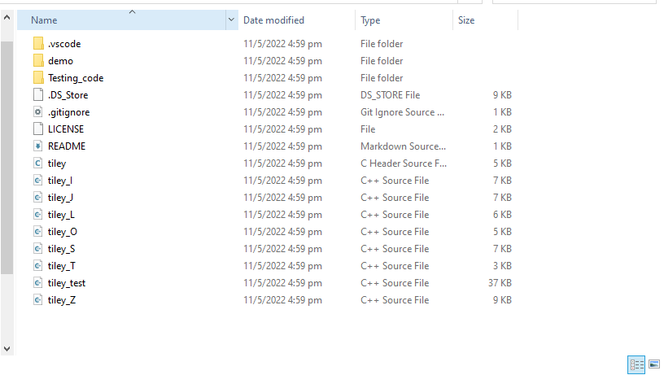
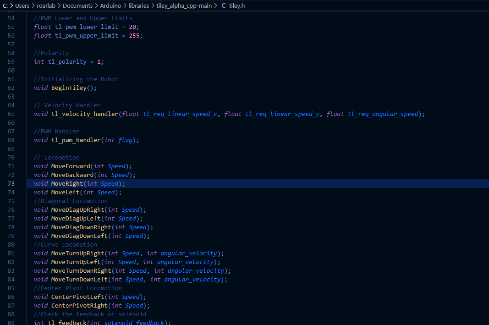
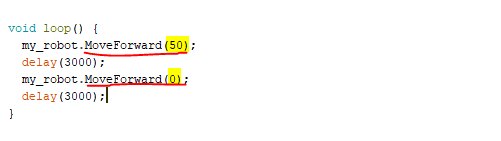

.. _ex3:

Exercise 3
==============
Items needed:
---------------
* An assembled Smorphi mini / Smorphi\ :sup:`2`  robot
* A computer
* A USB to USB-C cable
* Internet connection
  
Objectives of exercise:
-------------------------
1. Learn how to read code documentation
2. Figure out what are the functions that are present in the library and how to use those functions
3. Basic coding skills (how to call and use predefined functions)
4. Learning about code libraries and how they work

Steps  / Description:
++++++++++++++++++++++++

#. [What are code documentation?]
                        |  In the folder you downloaded from Wefaa Github, you will see the files below (Recap from exercise 2). |A| These ‘C++ Source File’ contain all the functions that come with this library. We can see what kind of functions are provided in this library so that we can use it for our application.
                        |  The Header file is ‘Smorphi’ and it defines all of the functions that are callable/ can be used in your code. The ‘Locomotion’ file implements the locomotion functions of Smorphi and allows the robot to move. The rest of the Source Files controls the shape changing capabilities of Smorphi.

#. [How to read documentation]
                        |    Open the C++ Header file using any code editor. If you do not have another code editor, you can download Visual studio (https://code.visualstudio.com/download), and follow the downloader to install the code editor.  Once the file is open, you will see all of the defined functions that you can use in your code. |B| 
                        |    As part of good coding practice, documentation is always provided to record how to use the functions provided. Below is an example of what a typical documentation looks like:
                             |      **BeginSmorphi()**
                             |      Initialise startup sequence of Smorphi, incl. Motor drivers, IO Expander, Interrupt Pins. 
                        |    Code documentation will try to explain the purpose of various library functions Try to look through the :ref:`documentation <code_refs>` and figure out what the other functions do.    

#. [Activity]
                        |    Now try following the below coding structure, swapping out the different functions (the function underlined in red) and variables (the number highlighted) and see how the robot reacts. |C| We will learn about what the different parts of the code mean and do in the next exercise.

