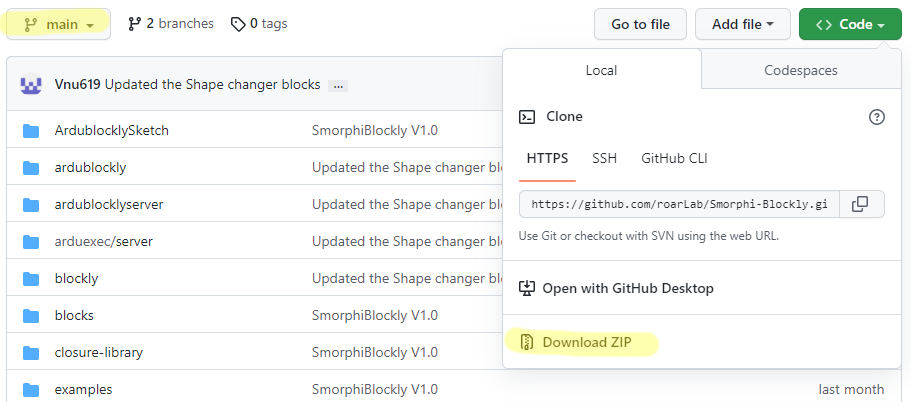
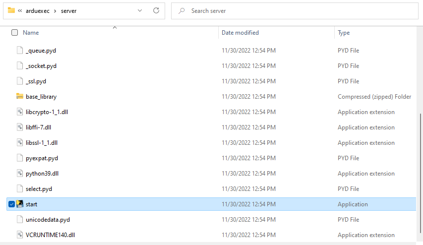
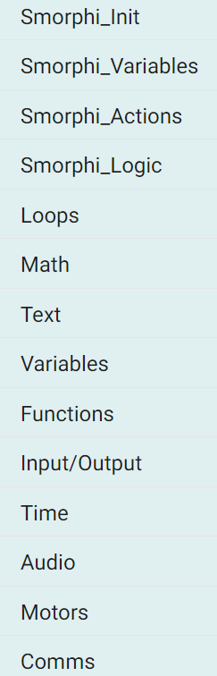
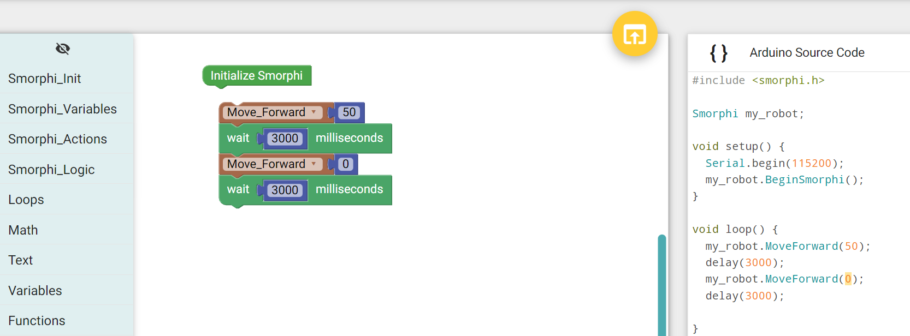
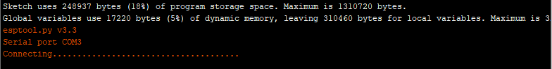

.. _ex4:

Exercise 4
==============
Items needed:
--------------
* An assembled Smorphi mini / Smorphi\ :sup:`2`  robot
* A computer
* A USB to USB-C cable
* Internet connection

Objectives of exercise:
-------------------------
1. Download and set up SmorphiBlockly
2. Learn how to use SmorphiBlockly

Steps  / Description:
++++++++++++++++++++++++

#. [Download SmorphiBlockly]
                        |  Go to `Smorphi-Blockly <https://github.com/WefaaRobotics/Smorphi_Blockly_V1.git>`_ to download the latest version of our files via the download zip button. It can be found in the drop down after clicking on the green Code button. Make sure you downloading from the Main Branch.  SmorphiBlocky is a visual graphical programming editor for Smorphi robots. It  Provide static type language blocks and code generators for programming on Smorphi robots. By dropping code blocks in the programme, C++ code will be generated which you can open in your Arduino IDE and upload to the Smorphi Master board.
                        |  Features of SmorphiBlockly consist:
                        |    * Programming Smorphi using drag and drop code blocks.
                        |    * Uploads the code using Arduino IDE to Smorphi Master board. 
                        |    * Useful "code block warnings". 
                        |    * Compatible with any Smorphi robots, Arduino and ESP32 related boards.
                        |    * Works on Windows / Linux.
#. [Setup SmorphiBlocky]
                        |    Unzip the downloaded zip file. In the Smorphi-Blockly-main folder, click on **arduexec->server->start** |B| After clicking on **start**, the programme will open. This will be where you will work with SmorphiBlocky.
 
#. [Blockly code blocks]
                        |    Blockly code On the interface, you can see the first 4 tabs mentioning Smorphi. This 4 tabs contain code blocks that you can use regarding Smorphi.
                        |    The rest are common code blocks that you can use generally. |C|

#. [How to use SmorphiBlockly]
                        |      If you take a closer look, you will see that these code blocks look like puzzles pieces. You can think of building your code like matching puzzles. |D| Some code blocks have missing piece in them, so you will have to fill in the missing code block.

#. [Setup your Arduino IDE] 
                        |      In order to run the code from SmorphiBlockly, we will need you to install the required Smorphi libraries into your Arduino IDE. You can refer to :ref:`Exercise 2 <ex2>` for more information. 
                        
#. [Test your setup] 
                        |      Place the following code blocks into the programme. Once you done click on the yellow button to open the code in Arduino IDE |E|
                        |      Upload your code from the Arduino IDE to the Smorphi Masterboard. Once upload is completed, press on the ENABLE button on the masterboard.
                        |      Your Smorphi should move forward for 3 seconds, stop for 3 seconds and then repeat.

#. **NOTE:** 
        |    Usually, when you upload the code to the master board, the process should complete automatically. However, sometimes the upload will be stuck at \‘connecting……\’ |F| 
        |    There are 2 solutions for this: 
        * Before it resolves into an error, press and hold the Boot button and click the enable button on the Master board at the same time, then release and wait. The code should complete the upload to the master board. 
        * You can unplug and reconnect the USB cable from the Master board to your computer and then reupload the code.

