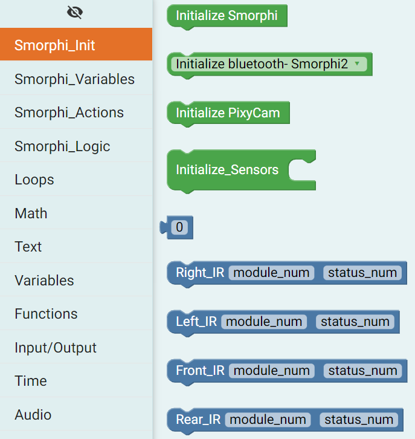
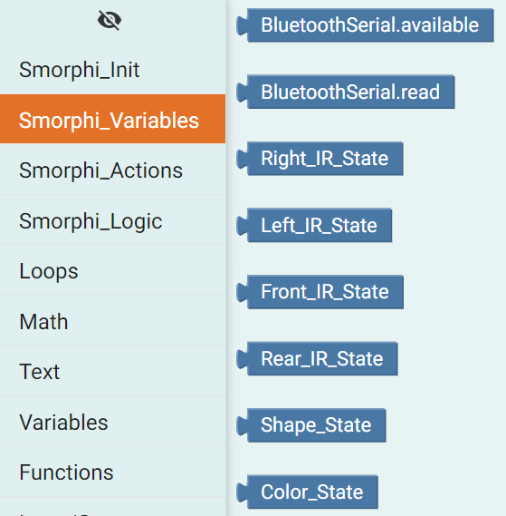
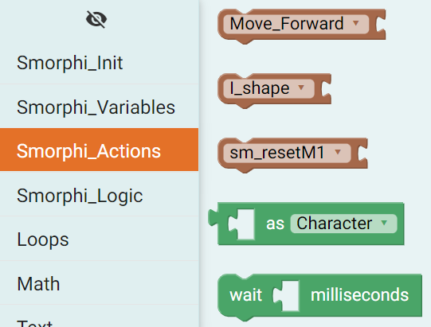
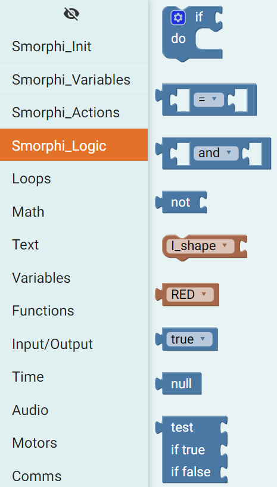
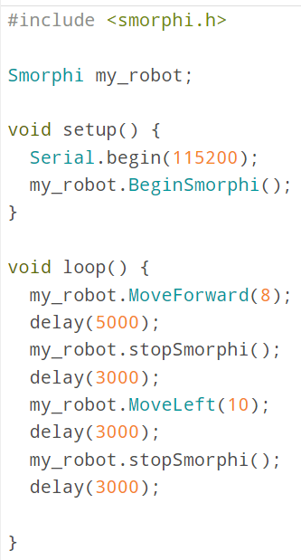

.. _ex5:

Exercise 5
==============
Items needed:
--------------
* An assembled Smorphi mini / Smorphi\ :sup:`2` robot
* A computer
* A USB to USB-C cable
* Internet connection

Objectives of exercise:
-------------------------
1. Learn about the various features of SmorphiBlockly
2. Practice coding with SmorphiBlocky

Steps  / Description:
++++++++++++++++++++++++

#. [Smorphi Initialization]
                        |  This is the first tab in SmorphiBlockly. When you click on Smorphi_Init, you will see this |A| The code blocks in green are the various initialization you can may need to use when coding. For Smorphi related codes, you will need to use the Initialize Smorphi code block. When you put the initialization code block, the required libraries will be included. Based on what you need work with on your Smorphi, you will have to initialize the following. For eg. If you are working with sensors on Smorphi, you will need to use the Initialize_Sensors code block.
                        |  The code blocks in blue allow us to set our variable to the sensor readings recorded on Smorphi.

#. [Smorphi Variables]
                        |    In this tab, you will see the variables that are frequently used on Smorphi. You can set values to these variables or use them for comparison. |B| 
                        |    For eg. You want to check if the front sensor detected something, you can utilise the variable Front_IR_State to check what is the value of this variable.  

#. [Smorphi Actions]
                        |    In this tab, you will see code blocks that will allow the Smorphi to do certain actions. |C| For eg. the Move_Forward block will allow you to move Smorphi forward. You can change the direction that Smoprhi move by clicking on the dropdown which will display the different directions. Something worth noting, the sm_resetM1 block allows Smorphi to reset its velocity.

#. [Smorphi Logic] 
                        |    In this tab, you will see some Boolean operators, values and a if statement. They are usually used to check for certain conditions that happen to Smorphi. |D| For eg. If Front_Sensor_State == 1, Smorphi will move forward.
#. [General code blocks]
                        |    The rest of the tabs contain common operations we can use for our code. You can take a look at each of them and figure how to utilise them in your code.

#. [Building your first Blockly Code] 
                        |      Now that you know about the various functions of SmorphiBlockly, let's try building your first Blockly code! Try making Smorphi
                        |       1.  Move forward with speed of 8 for 5 seconds
                        |       2.  Stop for 3 seconds
                        |       3.  Move left with speed of 20 for 3 seconds 
                        |       4.  Stop for 3 seconds then repeat from step 1 again
                        |      Once you are done, click `here <https://github.com/WefaaRobotics/Smorphi-Wiki/blob/main/Robot%20exercises%20images/5/6.1.png>`_ to check if your solution is correct.  

#. [Running it on Smorphi] 
                        |      The Arduino code generated from your blocky code will look like this |E| You can open this on your Arduino IDE and upload to your Smorphi to see it in action!

