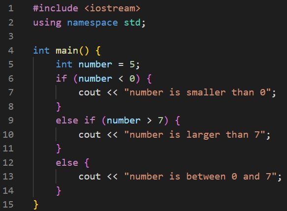
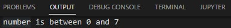
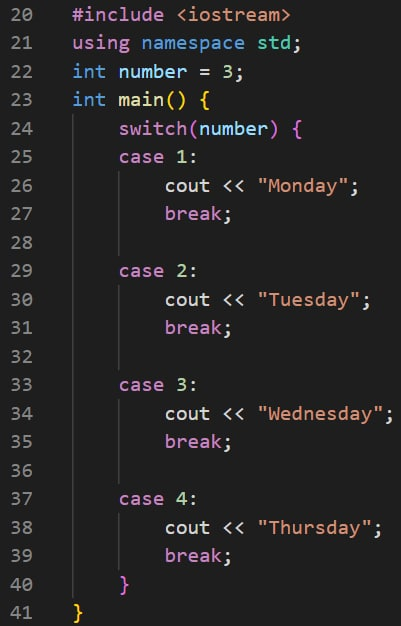
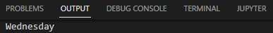
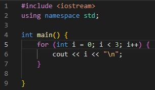
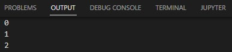
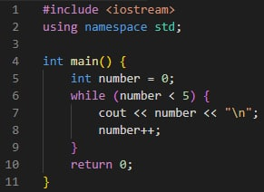
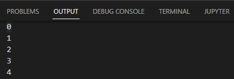
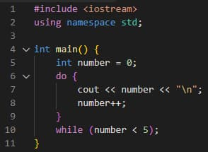

.. _ex6:

Exercise 6
==============
Items needed:
--------------
* An assembled Smorphi mini / Smorphi\ :sup:`2` robot
* A computer
* A USB to USB-C cable
* Internet connection

Objectives of exercise:
-------------------------
1. Learn about the various common coding languages being used today
2. Delve in depth into Arduino coding language
3. Learn about basic coding structures like, if, else, for etc.

Steps  / Description:
++++++++++++++++++++++++

#. [Commonly used coding languages used nowadays]
                        |   There are many different types of coding languages available currently, and each coding language is optimised for development of different things, like apps, websites, databases etc.
                        |   Some of the most commonly used coding languages currently is JavaScript, Java, and Python. https://bootcamp.berkeley.edu/blog/most-in-demand-programming-languages/. Each of the coding language have their own structures and way of usage but the main thing you should learn, to easily pick up any coding language in the future is the logic or thought process to write usable code.
                        |   In these series of exercises, you will be mainly exposed to Arduino which has a similar coding structure to Java.
                        |   *Food for thought: What other commonly used coding languages can you find and what are they commonly used for?*

#. [Basic coding structure of Arduino]
                        |    To use Arduino, you have to first know what the structure of the Arduino code and what various symbols the code may use mean. You can find out more about the Arduino coding language, C++, it’s structure and how to use it here: https://create.arduino.cc/projecthub/lina-tech-explorations/the-basics-of-arduino-programming-program-structure-functi-f5fb2c  

#. [Introduction to loops and conditionals]
                        |    Now. let’s learn about loops and conditionals in coding. Loops, as its name implies, allows for the block of code within it to be repeated multiple times, until the end condition is fulfilled. As for Conditionals, it diverts the flow of the code as different conditions are fulfilled, cause the code to react differently, hence the name. You can explore some code examples via this link: https://techexplorations.com/guides/arduino/begin/lsn7/
                        |    Then, lets try these loops and conditionals on your Smorphi.

#. [Use ‘if…else’ on Smorphi] 
                        |    In the article, you would have seen some pseudo code regarding the if…else conditional.
                        |    Easy example. What do you think the answer will be! |A| Check if you got the right answer! |B| 
                        |    Now that you know how if-else loops work, let's try to implement a variation on smorphi.

#. [Use ‘switch’ on Smorphi]
                        |    In the article, you would have seen some pseudo code regarding the switch statement.  Let's test your understanding. What do you think the output will be! |C| Check if you got the right answer! |D| Now that you know how switch statements work, let's try to implement a variation on smorphi.  

#. [Use ‘for’ with exercises] 
                        |      In the article, you would have seen some pseudo code regarding the for loop. 
                        |      Let's test your understanding. What do you think the output will be! |E| Check if you got the right answer! |F| Now that you know how for loops work, let's try to implement a variation on smorphi.   

#. [Use ‘while’ and ‘do…while’ with exercises] 
                        |      In the article, you would have seen some pseudo code regarding the while and do…while loops. Let's test your understanding with while loop |G| Check if you got the right answer! |H| Let's try the do…while loop |I| Check if you got it right! |J|
                        |      Now that you know how while and do…while loops work, let's try to implement a variation on smorphi.  

