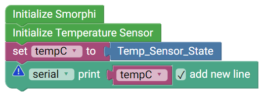

.. _ex7:

Exercise 7
==============
Items needed:
--------------
* An assembled Smorphi mini / Smorphi\ :sup:`2` robot
* Wefaa temperature sensor
* A computer
* A USB to USB-C cable
* Internet connection

Objectives of exercise:
-------------------------
1. Learn about the various commonly used sensors
2. Learn about the use of temperature sensor
3. Explore the different components on the temperature sensor board
4. Implement an application of a temperature sensor

Steps  / Description:
++++++++++++++++++++++++

#. [Brief introduction on commonly used sensors for robots]
                        |  Sensors are devices that give robots the ability to make ‘sense’ of the real world (the same way our five senses help us). Below are some of the most common sensors used in robotics:
                        |    * Light sensors
                        |    * Proximity sensors
                        |    * Sound sensors
                        |    * Temperature sensors
                        |    * Acceleration sensors
                        |    * Magnetic sensors
                        |    * Force sensors
                        |  https://electronicguidebook.com/common-sensors-used-in-robotics/

#. [Brief intro on what is a temperature sensor]
                        |    Temperature sensors has the ability to measure the temperature of the air (ambient), a solid, or a liquid. They can have many uses in robotics and can be used internally in the robot, or for external purposes.
                        |    When used internally, temperature sensors are used to ensure the temperature of the robotic system is within the safe working limits. Robots will employ a lot of electronics and motors that can get hot very fast. Temperature sensors are used to alert the control system when things get too heated.
                        |    When used externally, temperature sensors in robotics are used to measure the ambient air temperature, temperature of objects or of a liquid. For example, a robot might be used to travel to depths of the ocean where measuring and recording temperature information would be vital for scientists or researchers.
                        |    Common temperature sensors used in robotics include:
                        |      * Thermocouples
                        |      * Resistance Temperature Detectors (RTDs)
                        |      * Thermistors
                        |      * Semiconductor based IC sensors

#. [Smorphi's Temperature sensor]
                        |    |A|
                        |    The temperature sensor is the simplest sensor among the various sensors provided in the kit. It only has one active component, which is the temperature sensor component that can detect the temperature of the surroundings. This temperature sensor provided can only ambient air temperature or surface temperature of solids. 
                        |    *Do not submerge the sensor in water or any type of liquid.* 

#. [Introduction to the library of the temperature sensor] 
                        |    To aid in your learning, we have already provided you with a temperature sensor example below |B| Try to read through the code and its comments to understand how it works. Once you upload the provided temperature sensor code to the Master board. with the temperature sensor attached to the Master board, you will be able to use the temperature sensor to detect the surrounding temperature. Just ensure that your robot is still connected to your computer and open the serial monitor to view the temperature measured by the temperature sensor.
                        |    NOTE: The temperature sensor can only work if plugged onto the Master board. It will not work if plugged onto the slave board. You can choose which sensor port to use on the Master board by editing the example Temperature sensor code provided.

#. [Activity]
                        |    Your task now is to make the robot move forward as the robot sense a temperature higher than 30°C. You can implement your code in whatever way you like.
                        |    Once you are done, you can compare your solutions `here <https://github.com/WefaaRobotics/Smorphi-Wiki/blob/main/Robot%20exercises%20images/7/2.png>`_
#. [Further Exploration] 
                        |    Other than that, think of different scenarios where a temperature sensor will be important and how should your Smorphi react to different temperatures?

.. |A| image:: 1_TEMP.PNG
               :width: 800 

